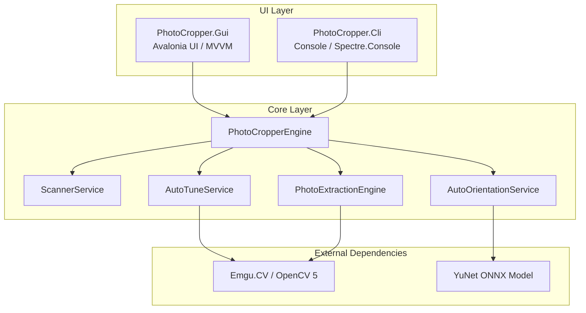
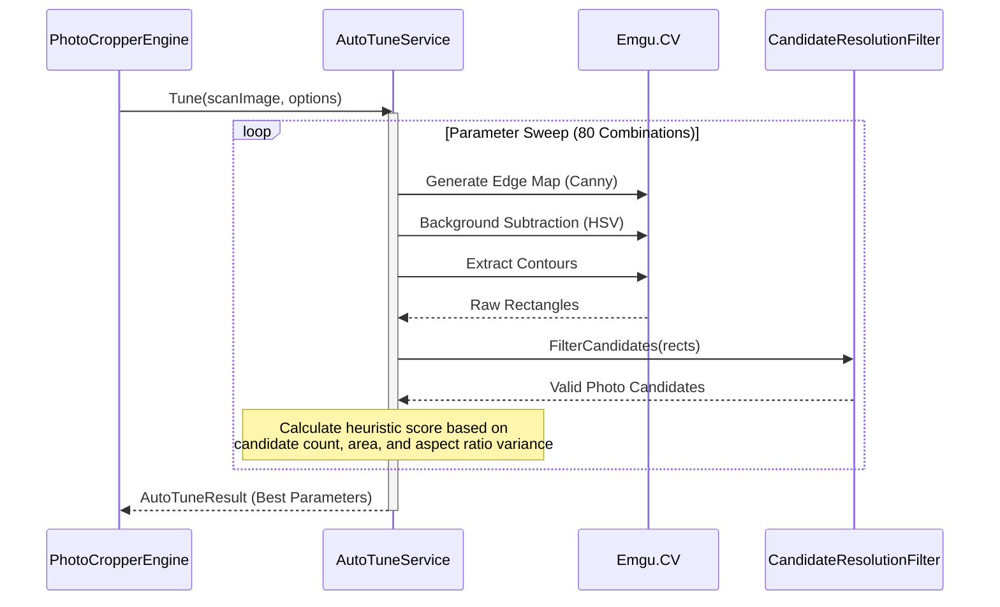
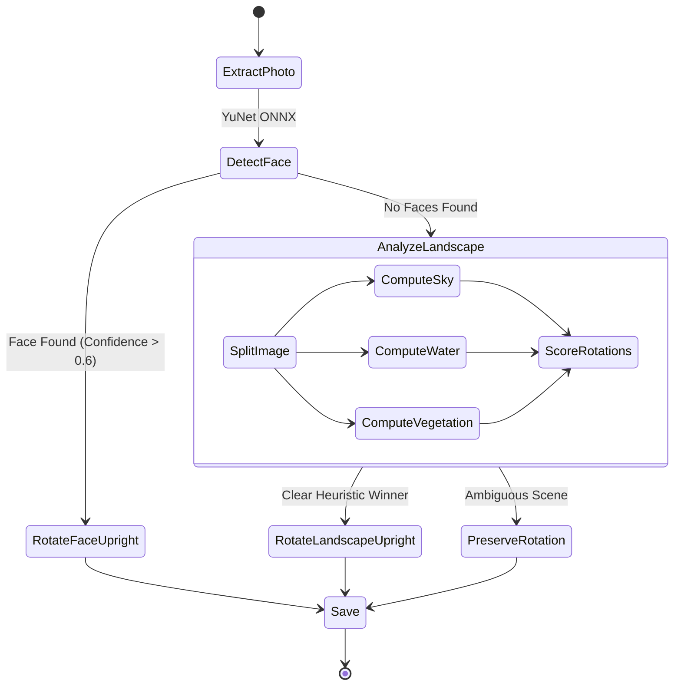

# PhotoCropper Architecture

PhotoCropper is built using a modular `.NET 10` architecture that cleanly separates the image processing logic from the user interfaces. The system uses `Emgu.CV` (an OpenCV wrapper) for high-performance computer vision tasks.

## High-Level System Overview

The solution is divided into three primary projects:

1. **`PhotoCropper.Core`**: The headless engine containing all OpenCV logic, models, AI orientation, and file I/O.
2. **`PhotoCropper.Gui`**: The Avalonia-based desktop application (MVVM).
3. **`PhotoCropper.Cli`**: The unattended console application for batch processing.

## Auto-Tuning Detection Pipeline

The core capability of PhotoCropper is automatically identifying physical photos placed arbitrarily on a scanner bed. Because scanners introduce different noise, light-bleed, and contrast levels, the `AutoTuneService` performs a combinatorial sweep across multiple thresholds to find the best extraction parameters.

## AI Auto-Orientation Heuristics

Once photos are extracted from the raw scan bed, they are often rotated (e.g. 90° or upside down). The `AutoOrientationService` uses a dual-pass approach to right the images:

1. **Primary AI Pass**: Uses the `YuNet` ONNX facial detection model to find human faces and measure their geometric rotation.
2. **Secondary Heuristic Pass**: If no faces are found, it analyzes the landscape using HSV ranges to find skies, water, and vegetation.

## Memory Management & Performance

Because working with uncompressed 600 DPI scans takes immense memory, the Core utilizes strict memory disposal patterns:
- Images are wrapped in `using var` statements aggressively.
- `GC.Collect()` triggers are hinted post-batch.
- Large processing arrays are pinned via `GCHandle` when interfacing between native C# memory and unmanaged OpenCV memory (e.g., ONNX extraction buffers).
- Background masks are calculated on heavily downscaled `Cv32F` representations of the image, running in under `<50ms`, while the final physical crop operation runs on the original full-resolution byte matrix.
